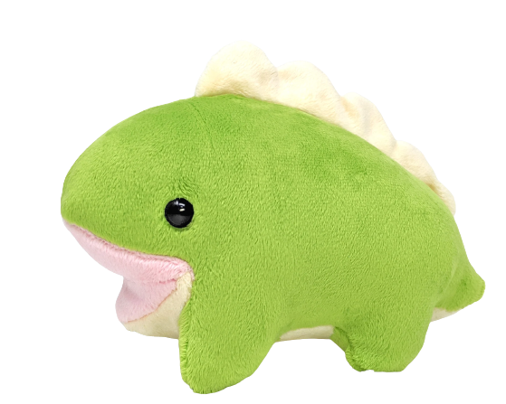

# stegosaurus
Multipurpouse steganalysis tool

## Build

`make ./`

## Visual Analysis

Analysise using the user interface:

`stegosaurus -i <image>`

Compare two images:

`stegosaurus -i <image1> --compare <image2>`

## Encoding LSB

##### Using the UI
- `stegosaurus -i <image>`
- then choose `LSB -> Encode` from the above menu
- insert your message
- press the [Encode] button

##### Using the CLI
- `stegosaurus -i <image> --lsb-encode "<message>"`
- 

## Decoding LSB

##### Using the UI
- Select `LSB -> Decode` from the above menu
- Open the file to be decoded

##### Using the CLI
- `stegosaurus -i <image> --lsb-decode`

### Optionals

Help: `stegosaurus --help`

Enable Verbosity: `stegosaurus -i <image> --verbose`